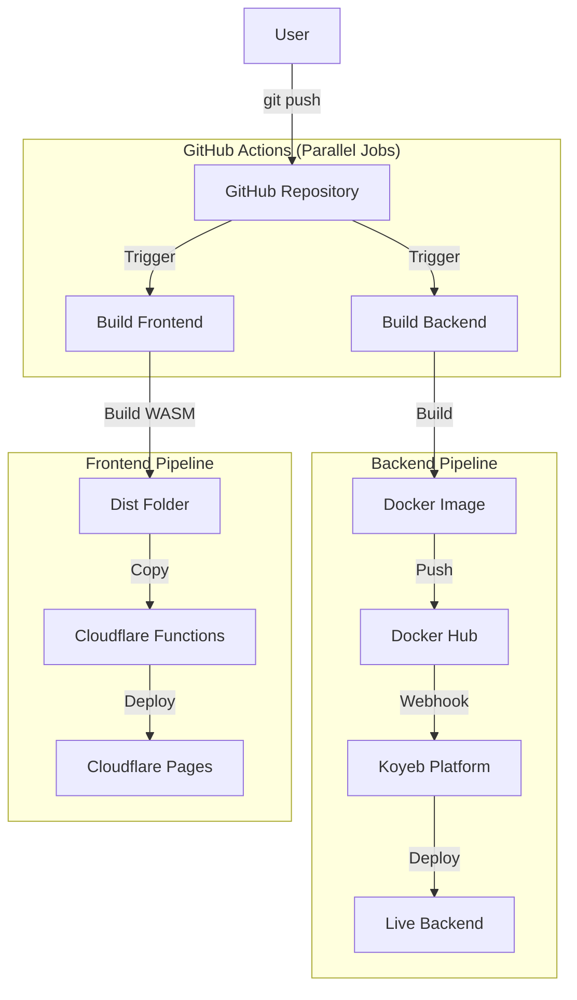

# Local Development vs Production Deployment

## Quick Reference

| Task | Command |
|------|---------|
| **Start local dev** | `.\dev.ps1` |
| **Deploy to production** | `git push origin main` |
| **Check prod status** | `curl https://unacceptable-dennie-axur-tool-8f97679f.koyeb.app/api/status` |

---

## Local Development

### Option 1: Use the dev script (Recommended)
// turbo
```powershell
.\dev.ps1
```

This starts:
- Backend on `http://localhost:3001`
- Frontend on `http://localhost:8080`
- Sets `API_BASE_URL=http://localhost:3001` for the frontend

### Option 2: Manual start

Terminal 1 - Backend:
// turbo
```powershell
cargo run -p axur-backend
```

Terminal 2 - Frontend:
```powershell
$env:API_BASE_URL = "http://localhost:3001"
cd crates/frontend
trunk serve
```

---

## Production Deployment

### Automatic Deployment (Recommended)

Just push to main:
```powershell
git push origin main
```

GitHub Actions will automatically:
1. **Frontend** → Cloudflare Pages (`axtool.pages.dev`)
2. **Backend** → Docker Hub → Koyeb (`xxx.koyeb.app`)

### Architecture in Production

```
Browser (axtool.pages.dev)
    │
    ├── Static files (HTML/WASM) → served by Cloudflare Pages
    │
    └── /api/* requests → Cloudflare Proxy → Koyeb Backend
```

The `_redirects` file in `crates/frontend/` configures the proxy:
- `/api/*` → `https://unacceptable-dennie-axur-tool-8f97679f.koyeb.app/api/:splat`
- This makes cookies work (same-domain from browser perspective)

### Verify Deployment

1. Check GitHub Actions: https://github.com/maisonnat/axur-tool/actions
2. Test status endpoint:
```powershell
curl https://unacceptable-dennie-axur-tool-8f97679f.koyeb.app/api/status
```

---

### Deployment Pipeline (Automated)

You do **NOT** need to manually touch Docker, Cloudflare, or Koyeb for standard updates.

**Your only action:** `git push origin main`

**What happens automatically:**


---

## FAQ: Understanding Recent Issues

### "Why are we having these problems now?"
We moved from a simple setup to a **secure, production-ready architecture**.

1.  **Security & Cookies**: 
    - *Before*: No auth, or simple validation.
    - *Now*: Secure, HTTP-only cookies (`SameSite::None`). Browsers block these by default between different domains (Cloudflare vs Koyeb). This required the Proxy fix.

2.  **Platform Limits**:
    - *Before*: Simple GET requests.
    - *Now*: Login uses POST. Cloudflare's simple `_redirects` feature doesn't support POST proxies, so we hit a "405 Method Not Allowed". We had to upgrade to **Cloudflare Functions**.

3.  **CORS (Cross-Origin Resource Sharing)**:
    - *Before*: Localhost talks to Localhost.
    - *Now*: Cloudflare talks to Koyeb. We had to explicitly whitelist headers to allow them to talk securely.

### "How do we prevent this?"
- **Dev/Prod Parity**: We created `dev.ps1` and the Proxy configuration so your local environment now mimics production closely (using the same proxy logic).
- **Status Endpoint**: The `/api/status` endpoint helps us instantly diagnose if the backend is reachable.
- **Automated Deployments**: By sticking to the CI/CD pipeline, we ensure that what works in the build process works in production, eliminating "it works on my machine" manual copy-paste errors.

---

## Environment Variables

### Local (.env file)
```
GITHUB_TOKEN=your_token
GITHUB_OWNER=maisonnat
GITHUB_REPO=axur-tool
GITHUB_LOGS_REPO=axur-logs-private
```

### Production Secrets

| Location | Variables | Purpose |
|----------|-----------|---------|
| **GitHub Secrets** | `CLOUDFLARE_*`, `DOCKERHUB_*`, `GH_*` | CI/CD deployment |
| **Koyeb Dashboard** | `GH_PAT`, `GH_OWNER`, `GH_REPO`, `GH_LOGS_REPO` | Runtime features |

---

## Troubleshooting

### 401 after login in production
- Check that `_redirects` file is being deployed
- Verify cookies are being sent (F12 → Network → check Cookie header)

### Status shows "degraded"
- GitHub variables not configured in Koyeb runtime
- This doesn't affect core functionality (login, reports)

### CORS errors
- Verify `_redirects` file exists in `crates/frontend/dist/`
- Check Cloudflare Pages deployment logs
