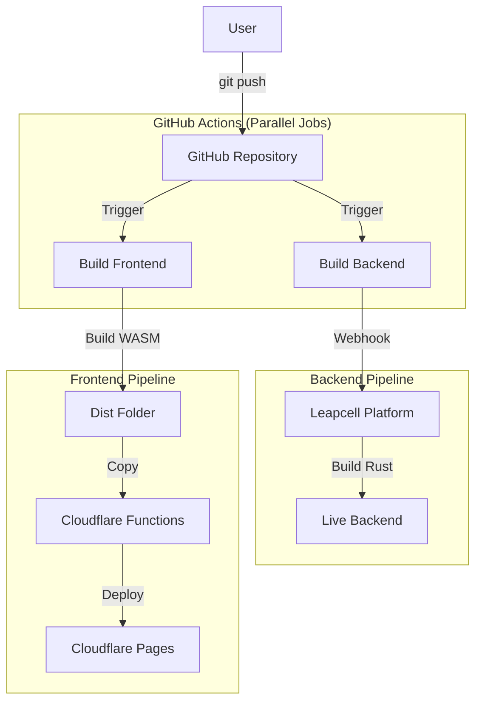

# Local Development vs Production Deployment

## Quick Reference

| Task | Command |
|------|---------|
| **Start local dev** | `.\dev.ps1` |
| **Deploy to production** | `git push origin main` |
| **Check prod status** | `curl https://axur-tool-maisonnat2655-5j70lozi.leapcell.dev/api/status` |

---

## Local Development

### Option 1: Use the dev script (Recommended)
// turbo
```powershell
.\dev.ps1
```

This starts:
- Backend on `http://localhost:3001`
- Frontend on `http://localhost:8080`
- Sets `API_BASE_URL=http://localhost:3001` for the frontend

### Option 2: Manual start

Terminal 1 - Backend:
// turbo
```powershell
cargo run -p axur-backend
```

Terminal 2 - Frontend:
```powershell
$env:API_BASE_URL = "http://localhost:3001"
cd crates/frontend
trunk serve
```

---

## Production Deployment

### Automatic Deployment (Recommended)

Just push to main:
```powershell
git push origin main
```

GitHub Actions will automatically:
1. **Frontend** → Cloudflare Pages (`axtool.pages.dev`)
2. **Backend** → Leapcell (native Rust builder)

### Architecture in Production

```
Browser (axtool.pages.dev)
    │
    ├── Static files (HTML/WASM) → served by Cloudflare Pages
    │
    └── /api/* requests → Cloudflare Proxy → Leapcell Backend
```

The `functions/api/[[path]].js` file configures the proxy:
- `/api/*` → `https://axur-tool-maisonnat2655-5j70lozi.leapcell.dev/api/:splat`
- This makes cookies work (same-domain from browser perspective)

### Verify Deployment

1. Check GitHub Actions: https://github.com/maisonnat/axur-tool/actions
2. Test status endpoint:
```powershell
curl https://axur-tool-maisonnat2655-5j70lozi.leapcell.dev/api/status
```

---

### Deployment Pipeline (Automated)

You do **NOT** need to manually touch Docker or Leapcell for standard updates.

**Your only action:** `git push origin main`

**What happens automatically:**


---

## Environment Variables

### Local (.env file)
```
GITHUB_TOKEN=your_token
GITHUB_OWNER=maisonnat
GITHUB_REPO=axur-tool
GITHUB_LOGS_REPO=axur-logs-private
```

### Production Secrets

| Location | Variables | Purpose |
|----------|-----------|---------|
| **GitHub Secrets** | `CLOUDFLARE_*`, `GH_*` | CI/CD deployment |
| **Leapcell Dashboard** | `GITHUB_TOKEN`, `AXUR_API_TOKEN`, `DATABASE_URL` | Runtime features |

---

## Troubleshooting

### 401 after login in production
- Check that Cloudflare Functions are deployed
- Verify cookies are being sent (F12 → Network → check Cookie header)

### Status shows "degraded"
- Environment variables not configured in Leapcell
- This doesn't affect core functionality (login, reports)

### CORS errors
- Verify `functions/api/[[path]].js` exists in deployment
- Check Cloudflare Pages deployment logs
