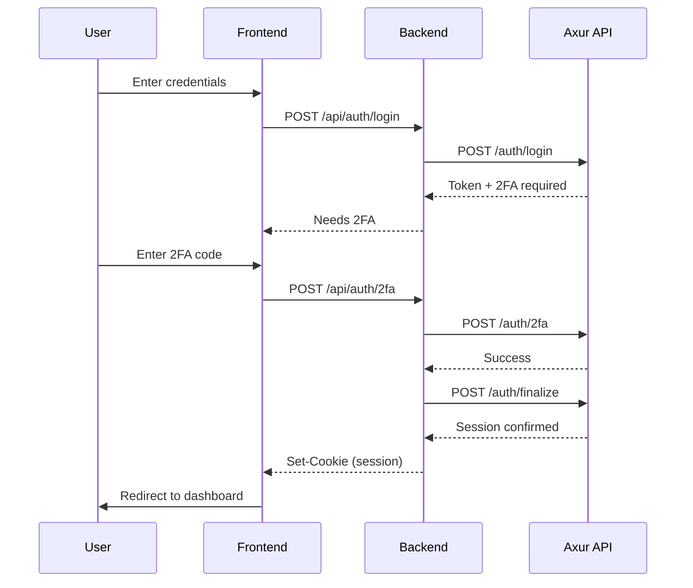
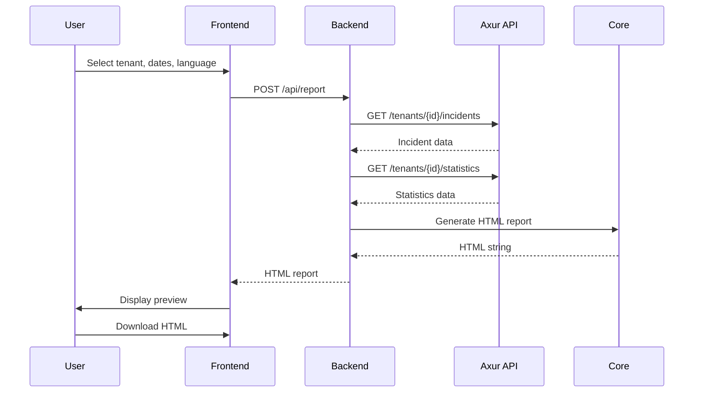

# Architecture

## System Overview

```
┌─────────────────────┐     ┌─────────────────────┐
│     Frontend        │────▶│      Backend        │
│   (Leptos/WASM)     │     │      (Axum)         │
│   localhost:8080    │     │   localhost:3001    │
└─────────────────────┘     └──────────┬──────────┘
                                       │
                            ┌──────────▼──────────┐
                            │     Axur API        │
                            │  (External Service) │
                            │  api.axur.cloud     │
                            └─────────────────────┘
```

## Components

### Frontend (Leptos/WASM)
- **Technology**: Leptos framework compiled to WebAssembly
- **Responsibilities**:
  - User interface rendering
  - Form handling and validation
  - Client-side state management
  - API communication with backend
  - i18n (Spanish, English, Portuguese)

### Backend (Axum)
- **Technology**: Axum web framework with Tokio runtime
- **Responsibilities**:
  - Proxy authentication to Axur API
  - Session management (cookies)
  - Report generation orchestration
  - CORS handling
  - Security headers

### Core (axur-core)
- **Technology**: Shared Rust library
- **Responsibilities**:
  - Axur API client
  - Data types and models
  - HTML report generation
  - i18n dictionaries

## Authentication Flow



## Report Generation Flow



## Data Flow

### State Management (Frontend)
```
AppState (Global)
├── is_authenticated: RwSignal<bool>
├── current_page: RwSignal<Page>
├── error_message: RwSignal<Option<String>>
└── ui_language: RwSignal<UiLanguage>
```

### Session Management (Backend)
- HTTP-only cookies for session tokens
- Session state stored in Axur API
- CORS configured for frontend origin

## Security Architecture

### OWASP 2025 Compliance
- **A01 (Access Control)**: Middleware auth on all protected routes
- **A03 (Supply Chain)**: Regular `cargo audit` checks
- **A10 (Error Handling)**: Proper `Result`/`Option` handling, no panics

### Headers
- `X-Content-Type-Options: nosniff`
- `X-Frame-Options: DENY`
- `Content-Security-Policy: default-src 'self'`

### CORS
- Allowed origins: Frontend development server
- Credentials: Included (for cookies)
